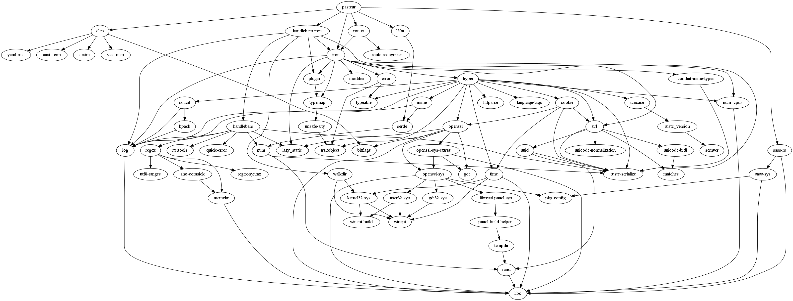

# Pasteur

[![travis-badge][]][travis] [![coverage-badge][]][coverage] [![clippy-badge][]][clippy] [![docs-badge][]][docs] [![license-badge][]][license] [![gitter-badge][]][gitter]

[license-badge]: https://img.shields.io/crates/l/cublas.svg?style=flat-square
[license]: https://github.com/adjivas/pasteur/blob/master/README.md#license
[docs-badge]: https://img.shields.io/badge/API-docs-blue.svg?style=flat-square
[docs]: http://adjivas.github.io/pasteur/pasteur
[gitter-badge]: https://badges.gitter.im/adjivas/pasteur.svg?style=flat-square
[gitter]: https://gitter.im/adjivas/pasteur?utm_source=badge&utm_medium=badge&utm_campaign=pr-badge
[travis-badge]: https://travis-ci.org/adjivas/pasteur.svg?branch=master&style=flat-square
[travis]: https://travis-ci.org/adjivas/pasteur
[coverage-badge]: https://coveralls.io/repos/github/adjivas/pasteur/badge.svg?branch=master&style=flat-square
[coverage]: https://coveralls.io/github/adjivas/pasteur?branch=master
[clippy-badge]: https://clippy.bashy.io/github/adjivas/pasteur/master/badge.svg?style=flat-square
[clippy]: https://clippy.bashy.io/github/adjivas/pasteur/master/log

#### Directory-Tree:
```
.
|__ Cargo.toml
|__ LICENSE-APACHE
|__ LICENSE-MIT
|__ README.md
|__ CHANGELOG.md
|__ templates/*
\__ src
    |__ middlewares/
    |__ controllers/
    |__ models/
    |__ lib.rs
    \__ main.rs
```

#### CLI:
See command **help**:
```
Pasteur
adjivas <adjivas@users.noreply.github.com>
A WebSite who synthesize all the knowledge about the autism

USAGE:
	pasteur [FLAGS] [OPTIONS] [SUBCOMMAND]

FLAGS:
    -h, --help       Prints help information
    -V, --version    Prints version information

OPTIONS:
    -a, --address <address>             Defines the ip's address.
    -c, --ca-cert <cert>                Defines the cert.pem's certificat.
    -k, --ca-key <key>                  Defines the key.pem's certificat.
    -l, --source-locale <locale>        Defines the locale's directory.
    -p, --protocol <protocol>           Defines the protocol. [values: http, https]
    -s, --socket <socket>               Defines the port.
    -t, --source-template <template>    Defines the template's directory.

SUBCOMMANDS:
    help    Prints this message
    test    controls testing features
```

#### GraphShot-Dependency:


[graph]: graph.png

#### License:
**pasteur**'s code in this repo is licensed under either of:

uses the [APACHE][license-mit] and [MIT][license-apache] license.
 * Apache License, Version 2.0, ([LICENSE-APACHE](LICENSE-APACHE) or http://www.apache.org/licenses/LICENSE-2.0)
 * MIT license ([LICENSE-MIT](LICENSE-MIT) or http://opensource.org/licenses/MIT)

[license-apache]: https://github.com/adjivas/pasteur/blob/master/LICENSE-APACHE
[license-mit]: https://github.com/adjivas/pasteur/blob/master/LICENSE-MIT

at your option.

#### Contribution:

Unless you explicitly state otherwise, any contribution intentionally submitted for inclusion in the work by you, as defined in the Apache-2.0 license, shall be dual licensed as above, without any additional terms or conditions.
